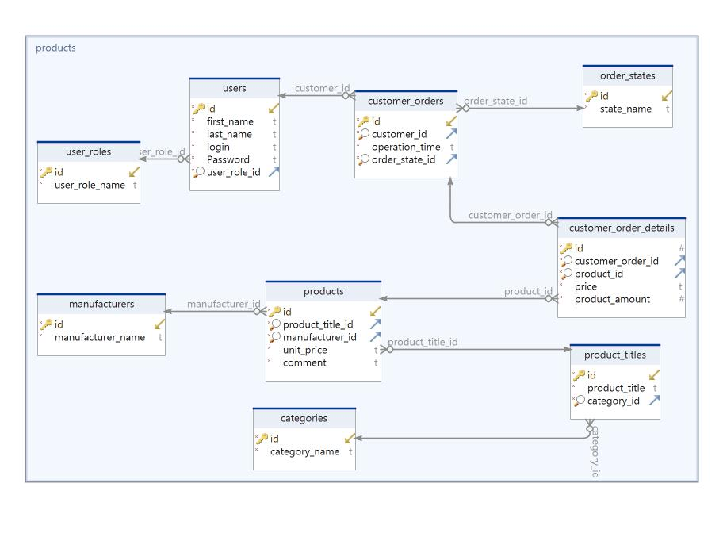

# Online Store Console Application

## Database structure Implementation

###  Database schema
Your online store database schema must correspond to the given schema  
  

### Data Entities
1. Create new branch **step1-DB-schema** from **main** branch.  
2. Open project **StoreDAL**
3. Go to the folder **Entities**
4. Add attributes to make tables and columns names according to the DB schema.
5. Add relations between DB tables according to the DB schema.

### Initial DataSet
1. Go to the **Data/InitDataFactory** folder and open file **TestDataFactory.cs**
2. For each occurrence of **Array.Empty<....>()** replace it with array with the correct initial data

