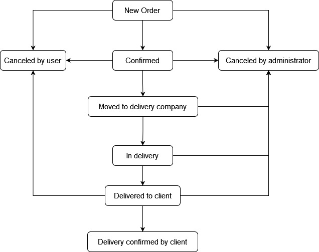

# General Task Description
Develop a console application .NET that simulates the work of an online store. 

## User's Roles

You have to implement next roles of users:

- Guest; 
- Registered user; 
- Administrator.

### Role "Guest"

The guest user is the default role that you have to implement in your aplication. The next functionality for guest user must  be implemented: 

- view list of goods; 
- user account registration; 
- admission to the online store with an account.

### Role "Registered user"

The user with registered "user role" must have next implemented functionality:  

- view the list of goods; 
- creating a new order; 
- ordering or cancellation; 
- review the history of orders and the status of their delivery; 
- setting the status of the order "Received"; 
- change of personal information; 
- sign out of the account.

### Role "Administrator"

The user with registered "user role" must have next implemented functionality:  

- view the list of goods; 
- creating a new order (admin can buy something in our shop too); 
- viewing and changing personal information of users; 
- adding a new product (name, category, description, cost); 
- change of information about the product; 
- change the status of the order; 
- sign out of the account.
 
## Common requirements

1. In the case of creating a new order, the status "New" is automatically set. All other statuses are set manually by the administrator. Except for "Canceled by user".

2. When designing classes use the principles of S.O.L.I.D. 

3. Deny invalid user actions. 

4. Cover the main functionality with Unit-tests. 

5. Use a design patterns.

6. Implement the Multilayered architecture in several projects. 

7. Add to all interfaces, classes and their members detailed code documentation using XML-comments. 

8. You must implement checking of orders state changing possibility  to new for all requests.  All of possible state changes shown  on a next figure. 
If the user has selected an incorect new status of order you must keep the last valid state.

  

9. Each order in your application will have next states:

- **New Order**
- **Cancelled by user**
- **Cancelled by administrator**
- **Confirmed**
- **Moved to delivery company**
- **In delivery**
- **Delivered to client**
- **Delivery confirmed by client**

