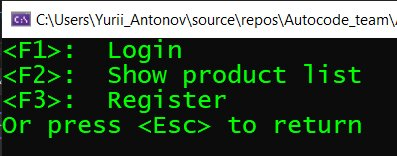
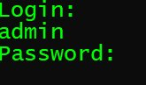
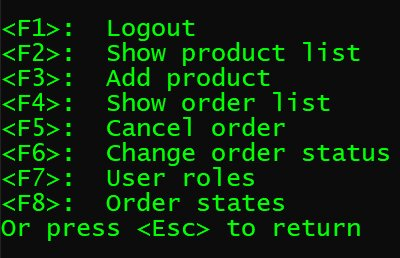
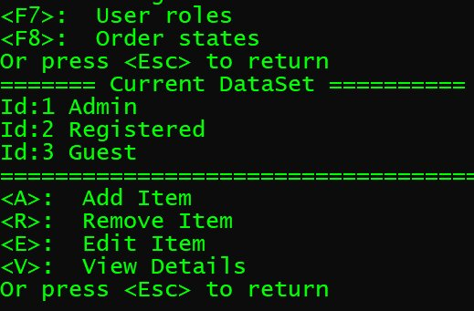
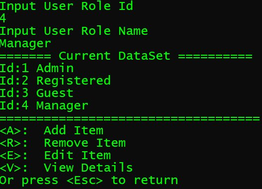
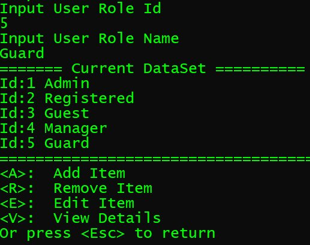
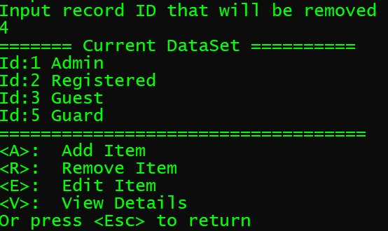
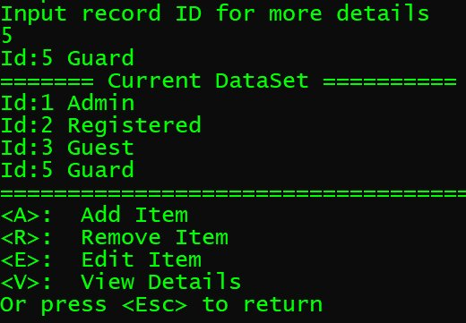

# Introduction

## How does it work?

### Start you console aplication
After start, your console application must look like next picture  

  

You can choose any action by key that specified in **<**  **>** symbols. 
For example, you can press the **\<ESC>** button to exiting the current menu.  
In picture above you can press **\<F1>** key to login. Two logins are available in the demo: admin and user without passwords.  

  
If you are loggined as an admin you must see new menu.  

  

Press **F7** to work with **User  roles**  

  

You can see the context menu under the current database. Press the **\<A>** button to add a new user role.  
And type  
**4** **\<Enter>**  
**Manager** **\<Enter>**  

  

As you can see, a new role has been added in the database. 
In the next step, you can add a new role **Guard** with id **5**. 
This record will also be added to the database.  

  

To remove record with id=4, please press key **\<R>**  and type record id.
The selected record has been removed from database  
  

Press **\<V>** to view more details about user role with ID=5 and type  
**5** **\<Enter>**  

  

